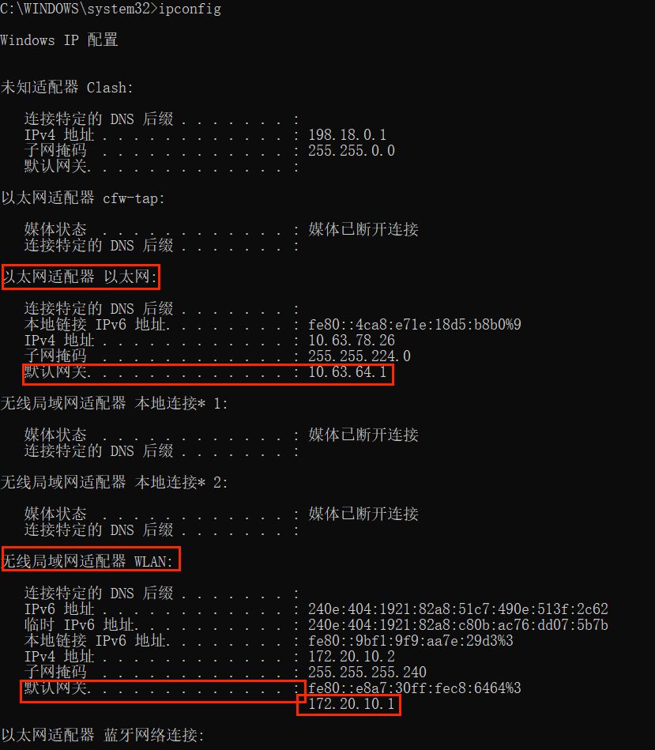

## 电脑通过网线访问内网，同时通过手机热点访问外网

## 步骤
1. 获取手机热点和网线的网关地址
2. 管理员身份运行cmd，输入 `ipconfig`
3. 获取 以太网适配器 和 无线局域网适配器 的网关
  
4. 在`router.bat`文件中配置要走内网的ip (修改大括号`{}`中的内容)
  ```bash
      route add {要走内网的ip地址} mask 255.255.255.255 {内网网关}
      route delete 0.0.0.0
      route add 0.0.0.0 mask 0.0.0.0 {热点网关}
   ```

1. 资源管理器中右键 `router.bat` 以管理员身份运行
